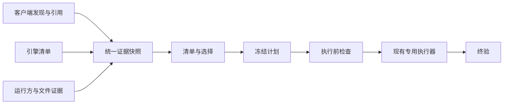

# 多客户端记录清理施工方案

状态：待实施。本文承接已完成的 0.2.0 清理核心重构，规划现有客户端契约收口和
Orca、Herdr 接入。当前功能以 [设计与安全边界](design.md)、
[Operation CLI](operation-cli.md) 和 [Adapter 贡献指南](adapters.md) 为准；
下文拟新增的接口、字段和能力不是支持声明。

## 目标与已完成基线

目标是让同一套记录清理流程正确回答：记录属于哪个客户端和存储、被谁引用、关系是否
完整、哪些动作确实可执行，以及执行后还剩什么。新增客户端应复用身份、计划、保护和
恢复机制，各引擎继续保留自己的删除语义。

以下已经完成，不另起一轮重写：

- `CleanupService`、不可变计划、按物理存储和 mutation family 划分的子批次，以及
  `status/verify` 恢复；Codex、Pi、Claude 和已有前端使用各自精确写入器。
- Codex 正常子记录沿真实原生父链判断，不因缺少独立前端引用而成为孤儿。
- 多 profile、多引擎、同名 ID 隔离；current/history 精确绑定；Cindy Claude
  独占与共享 root 的一致发现；读取错误和逐记录 blocker 贯穿清单与选择。
- 正常原生独立记录、未知 backend、未证明归属分别处理；分类不授予删除能力。

两次分类与清单修复对应 `5579e4f`、`2942843`。后续提交以此为行为基线，补充缺失
契约，不借重构改变已验证的选择和删除范围。

## 范围与优先级

| 对象 | 本轮施工目标 | 明确边界 |
|---|---|---|
| Cindy：Codex、Claude Code、Pi | 作为公共契约的主要验收样本，保持当前已验证能力 | 三种父子/分支语义分别处理；共享 root 不等于 Cindy 独占 |
| AionUI | 同步迁移清单、引用与能力声明 | 未支持 schema 继续只读 |
| 原生 Codex、Claude Code、Pi | 验证独立存储与第三方共享存储并存 | 没有前端引用不等于垃圾 |
| Codex/ChatGPT Desktop 本地编码环境 | 保留已探测的本地 catalog、UI 引用和环境注册能力 | 不扩展为原生 ChatGPT 云端聊天或云端项目清理 |
| Orca | 先接入本机 Codex 多 home 清单与桥接关系，再评估精确删除 | 其他引擎逐项取证；首版不执行 WSL/SSH/远端写入 |
| Herdr | 先接入本机 server/session 元数据及恢复引用，再评估精确删除 | pane、server、native record 是不同对象；detach 不代表停止 |

优先交付公共契约和可信清单。Orca、Herdr 即使暂时只能盘点，也可以单独交付；
缺少生命周期或写入证据时不为完成排期开放删除。

## 总体设计

继续使用既有执行链，不建立第二套扫描器或删除服务：

### 收敛四类契约

在现有 `record_identity.py`、`core_types.py` 和 adapter 接口上渐进补充，先有真实
消费者再提取共享模块。下表是目标契约，不预定必须新增同名类。

| 契约 | 必须表达的内容 | 负责模块 |
|---|---|---|
| 客户端描述与能力 | client/profile、原始 backend、已验证 engine、版本/schema/runtime 证据；发现、原生删除、前端清理、归属检查、终验分别声明 | `adapter_factory.py`、`adapters/`、`record_identity.py`，复用 `action_registry.py` |
| 存储与记录 | 本地 host、路径命名空间、逻辑 store、storage-qualified record；已知文件别名和探测完整性单列 | `record_identity.py`、`path_identity.py`、`discovery.py`、各 engine catalog |
| 引用与关系 | current/history/restore、精确来源定位、生命周期；关系类型、两端身份、证据来源、完整性和冲突 | `client_inventory.py`、`session_catalog_factory.py`、各客户端引用提取器 |
| 运行与验证 | 真正 writer、owner root、进程及 server/session 归属；冻结范围、漂移原因和终验结果 | `codex_desktop_state.py` 的现有 inspector、`targeted_guard.py`、`operation_coordinator.py`、各 writer |

能力必须由当前证据和已注册实现共同决定。产品版本号本身不能证明 schema；原始
backend 名称也不能通过公共别名自动获得 writer。只读 adapter 不应被迫伪造
`database` 或 `codex_home` 来满足旧 Codex `FrontendAdapter`；旧接口保留兼容 facade。
发现注册保持显式代码，不引入任意动态插件加载。

### 五个判断独立保存

原生是否存在、客户端归属是否确定、引用生命周期、关系是否完整、删除是否可执行，
是五个独立判断。分类只做展示投影，错误和 blocker 保留到 plan/apply。

- 完整父链上的 Codex 子记录是正常关联记录；确认缺父、父链未知、父链冲突分别表达。
- Pi `parentSession` 是分支来源，不自动级联；Claude session 专属 subagent 文件按
  manifest 冻结，消息 `parentUuid` 不成为另一个 session。
- 前端 pane/layout 或恢复引用不自动成为 native 父子边。历史、恢复、软删除等状态
  分别保留，并由已验证生命周期决定保护行为；未知恢复语义阻止相关 native 删除。
- 同一个物理文件的 hardlink/symlink 是别名证据，不把不同 store 的记录自动合并，
  也不自动把其他账号或客户端加入授权范围。
- 首版执行端只支持本机。远端路径保留为不透明定位信息并报告边界，不能传入本机
  `Path` 后当作本地目标。

## 分阶段施工与交付门槛

### P0：固定兼容基线与验收样本

**改动范围：**现有 inventory、selection、operation、recovery 测试及
`docs/adapters.md`。先整理已覆盖用例，只补缺口，不复制实现细节作为测试。

为现有客户端建立共同契约用例：多 profile/跨引擎同 ID、无前端行、current/history
同时存在、共享 Claude root、正常 Codex 子链、Pi fork、Claude manifest、未知 backend、
部分读取失败。给旧计划和 operation 状态准备脱敏的最小固定样本，包括未执行、
mutation 已开始、unknown、partial 和终态回执。

**完成条件：**能明确列出各组合已有能力和限制；同一临时存储经不同入口得到一致的
目标身份、引用、错误与可选择性；固定样本不含聊天正文、真实路径或凭据。

### P1：公共契约收口，并迁移现有客户端

**依赖：**P0。**改动范围：**上面的四类契约模块，以及 CLI/GUI 对应直接消费者。

1. 为现有 adapter 的发现、引用、catalog、运行归属和能力提供明确类型边界；复用已有
   grouped catalog，保留每个来源的完整性和错误范围。
2. 将关系类型和证据显式传递到清单，继续使用各引擎自己的分类和范围计算。
3. 按 Cindy → AionUI → native/独立 Pi/Claude 的顺序迁移，移除本次实际替代的
   Codex 专属假设与重复分支；不同时重写 writer。
4. CLI/Agent/GUI 只消费公共结果；用架构测试限制新依赖方向，避免品牌判断重新进入
   通用类型或另起一套清单逻辑。只有实际重复的 adapter 构建逻辑才抽成静态注册表。

**完成条件：**P0 用例全部保持语义一致；未知引擎不会进入任何 native writer；
未受影响的旧计划、JSON 输出字段和精确选择仍兼容；新增证据字段缺失时表示未知。

### P2：补齐本地文件别名、运行归属与计划兼容

**依赖：**P1。**改动范围：**`path_identity.py`、discovery/inspector、
`targeted_guard.py`、`operation_coordinator.py`、`operation_store.py` 及协议测试。

- 建立本地文件身份/别名证据：在支持的平台探测文件 ID、链接数、symlink 目标及
  已发现路径；区分已知别名集合与已经证明完整的集合。链接数不一致、范围外目标、
  断链或探测失败都不能被当作完整范围。不遍历全盘寻找未知副本。
- 建立运行归属证据：client owner root 与 native root 分开；将 server/session、
  引擎子进程、已知共享 writer 纳入相关目标检查。进程名或“窗口已关”不足以放行。
- 对影响授权的新证据执行下节的版本兼容规则；受影响的身份、引用、别名、关系和
  writer 检查在 apply 前重验证，中途漂移停止剩余动作。
- 为后续 adapter 提供上述证据接口；此阶段不新增跨 store 文件删除或远端执行器。

**完成条件：**临时目录中的链接、路径替换和进程模拟能证明范围外记录不受影响；
无法证明别名或 writer 时有稳定 blocker；旧 unknown 操作仍可 status/verify，
任何恢复路径都不会重发 mutation。

### P3：Orca 本机只读接入

**依赖：**P1、P2。**改动范围：**新增 Orca adapter/引用提取器、discovery 和
对应临时存储测试；注册清单能力，删除能力保持关闭。

先固定上游 commit/产品版本、schema 样本和来源。上游已知存在按账号发现 Codex homes
及 hardlink 优先、symlink 回退的 session bridge；证据链接见
[Orca 接入边界](adapters.md#orca-与-herdr-的接入边界)，不能将浮动 `main` 当兼容版本。

首批只枚举已探测的本机默认或明确指定 userData 下的 runtime/account homes，读取
最小引用元数据，复用 Codex catalog；同时显示逻辑存储、已知桥接别名及完整性。
账号切换后旧 home 仍需发现，但账号身份不替代存储身份。发现不能调用会创建或同步
managed home 的 helper。WSL/SSH/其他引擎仅报告可证明的线索或不支持边界，不声称
已经扫描完整。

**完成条件：**覆盖多账号同 ID、runtime/account home 重合、hardlink、symlink、
复制文件、断链、范围外链接、账号切换、未知 schema 和部分读取失败。单一路径消失
不能显示“整条记录已清空”；所有删除入口均无法绕过只读能力声明。

### P4：Herdr 本机只读接入

**依赖：**P1、P2；研究可与 P3 并行，代码按单写者顺序提交。
**改动范围：**新增 Herdr adapter/引用提取器、运行归属探测和临时样本测试。

固定上游版本和 schema，限定本机明确的 server/session。只读获取已验证的 live
metadata 与 `session.json`、layout snapshot 中的结构化 native 恢复引用；持久化
证据和 live 证据分别记录，失败、冲突、时间差不能被折叠为空清单。未识别的
snapshot/backup 格式明确报告覆盖不足。socket 探测不隐式启动 server，不执行
pane 命令，不恢复 session，不读取终端正文或环境凭据。

已知 Codex/Claude/Pi backend 也必须证明精确 native root 才能关联原生 catalog；
只得到 ID 的引用保留为未验证。detach、pane 关闭和 native record 删除分别表达，
恢复 snapshot 有引用时不能因当前布局为空而认定记录失去用途。

**完成条件：**覆盖 detached server 仍运行、pane 结束但 snapshot 可恢复、多个
server/session 同 ID、已知引擎但未知 root、未知 backend、socket 不可达、损坏状态、
live/persisted 冲突和远端 host。错误保留在清单，native/frontend 写入均关闭。

### P5：逐组合开放精确删除

**依赖：**相应 adapter 的 P3 或 P4 完成。Orca、Herdr 分别推进，一个组合未达标不
阻止另一组合保持只读或交付。不得按产品名一次打开所有引擎和所有 schema。

每个 `client × engine × schema/runtime × OS × mutation family` 必须交付以下证据：

1. **范围明确：**来源、引用生命周期、完整目标和关系/别名范围可冻结；相关共享
   客户端和 writer 可发现。引擎必需的后代或 manifest 成员须在计划中显示并冻结；
   桥接、父链或恢复布局不能成为越过明确授权范围的依据。
2. **写入契约明确：**确认 native API/文件 writer 的实际副作用；前端字段清理有
   自己的精确 schema、定位和回滚规则。优先复用现有 writer，不以 pane close、
   detach、目录递归删除或账号清空代替逐记录操作。
3. **保护与终验完整：**真实 writer 已停或存在已验证的等价排他机制，apply 检测
   漂移，verify 覆盖所有批准副本和引用。既有 `--clients-closed` 契约仍须满足，
   若需改变关闭要求必须另行设计并验证协议，不能由新 adapter 自行绕过。
4. **故障可收口：**崩溃、超时、部分成功与回滚失败后可以跨进程 status/verify；
   ambiguous mutation 不重发；计划、journal、回执均无聊天正文。

Orca 无法证明桥接范围或 API 对共享文件的作用时，该目标保持只读；首个可写范围
可以仅限无桥接且归属完整的目标。Herdr 无法精确处理仍可恢复的引用或无法证明后台
writer 已停时，对应 native 删除继续阻止。删除前端引用与删除原生记录分别授权。

**完成条件：**完整临时存储端到端用例证明“只改批准目标、终验无批准范围内残留、
范围外记录不变”；未通过探测的 schema/runtime 变化退回只读。运行时只开放实际
通过验收的组合，不因另一组合已经通过而继承权限。

### P6：发布收口

沿用 Windows/macOS/Linux × Python 3.10/3.12 的既有 CI 矩阵。链接、文件身份和
进程归属等平台相关能力，须在实际支持平台执行对应测试；skip 不作为该能力通过的
证明。不支持探测的平台验证保守阻断，并在兼容矩阵中明确保留只读。

性能沿用每 store 一次 planner catalog pass、action loop 不重建全库、Codex 同批
单 app-server；healthy/native 已有两次完整扫描的基线不退化，其他路径按各自契约
验证，不承诺所有新客户端两次扫描完成。

同步当前功能文档、CLI 示例和 CHANGELOG，只声明已经验收的能力。发布、推送和真实
记录操作按届时授权执行；整个开发验证只使用临时存储，真实清理不能用作测试。

## 冻结计划与升级兼容

- 一个顶层 operation 可以包含多个预先冻结的子批次；每个子批次只写一个物理存储和
  一种 mutation family。跨批次不构成事务，新发现的目标绝不进入旧授权。
- 先新增清单投影和内部类型，保留不受影响的旧字段及身份算法。所有能影响授权的
  新字段必须进入计划证据和 hash，不能仅附在显示字段中。
- 必须改变身份、hash 或批准语义时，显式升级受影响的 plan/evidence schema，并
  同时提供旧格式读取与兼容测试；不能给持久化旧计划补字段、重算 hash 后继续执行。
- 未开始的旧计划只有在原契约仍足够且证据可重验证时才能 apply；缺少新必需证据时
  阻止并要求重新生成计划。已经执行的原 operation 保持冻结证据，不得改写或重建
  原 operation 后重发 mutation。结果未知时先 status/verify；未收口前不得通过新
  计划绕过禁止重发，证据不足则保留 unknown，不伪造完成。
- 结果已知且仍在授权范围内的残留，可以沿用现有 `delete run` 流程生成独立新
  operation 和 hash；新计划不改变旧 operation 的证据，也不扩大原授权。
- 沿用现有临时回滚副本和最小回执生命周期，不引入长期备份、隔离区或 restore 命令。

## 提交安排与验收清单

在现有 `main` 使用一个写者；研究和只读 review 可并行，不为本方案自动创建分支或
worktree。P0、P1、P2 分别提交；P1/P2 可按契约和消费者拆成可验证的小提交；P3、P4
各自提交；P5 按能力组合提交；P6 收口。某一 adapter 卡在证据门槛时，只保留它的
只读成果，不回滚已验证的公共改进。新能力通过默认关闭的显式能力声明隔离；源码
回退不能丢弃已产生 operation 的旧格式 reader/verify。

| 验收维度 | 必须证明的反例 |
|---|---|
| 身份与选择 | 同名 ID、跨 profile/引擎/store/host 不串；共享文件不自动合并授权 |
| 关系与引用 | 正常子记录不误报；Pi fork 不级联；Claude manifest 不漏项；历史和恢复引用不丢失 |
| 不完整证据 | DB/socket/catalog 失败不是零记录；未知 schema/backend 不获得 writer；错误范围准确 |
| 运行保护 | 无窗口但后台 server/agent 活跃仍阻止相关写入；明确无关进程不误挡独立 store |
| 并发与恢复 | 新引用、新链接、文件替换和 schema 漂移被挡住；超时/崩溃后不会二次删除 |
| 输出与性能 | 元数据之外不泄露正文或凭据；不同入口一致；批量动作不逐项重扫全库 |
| 升级与平台 | 旧 plan/journal/receipt 可诊断；缺证据旧计划不执行；平台探测失败安全降级 |

施工完成分两档：P0–P4 完成即具备公共契约和两个新客户端的可信盘点；P5–P6 只对
证据、执行和终验均通过的组合宣告删除支持。原生 ChatGPT 云端、WSL/SSH 执行、动态
插件平台、全盘副本搜索及通用恢复平台不纳入本轮；以后需要时另立具体契约。
