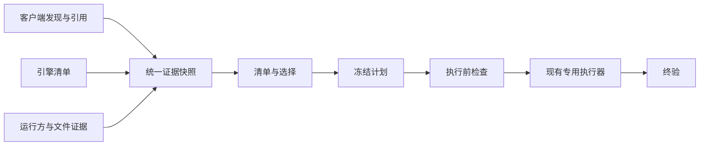

# 多客户端记录清理施工方案

状态：P0–P4 的限定功能已落地；后续完整删除流程继续开发。办公版已接入本地
SQLite、SDK 文件和 Chromium 界面状态的双根删除及冷验证；Herdr、Paseo 和 Orca
前端恢复状态的完整删除仍待补齐。此前 P5 的 Orca/Codex/Windows 原生组合与 P6
平台验收仅代表当时范围，不能替代新增全流程的验收。本文承接已完成的 0.2.0 清理核心重构，
规划现有客户端契约收口和 Orca、Herdr 接入；追加千问办公、QoderWork 与 Paseo 的独立适配。
当前功能以 [设计与安全边界](design.md)、
[Operation CLI](operation-cli.md) 和 [Adapter 贡献指南](adapters.md) 为准；
下文拟新增的接口、字段和能力不是支持声明。

P3a 的[公共清单与保护接线](adapters.md#类型化清单入口)已落地：限定记录选择保留相关
类型化 `SourceFailure`，明确 store 的错误不扩大到独立 store；候选与保护 adapter 分开，
plan/apply、直接入口、执行前刷新和恢复保留同一存储的只读上限及精确引用保护。
旧 v1 `status/verify` 继续只读诊断，不重发未知 mutation。Orca 的有界发现与 journal
reader 已接入同一公共清单和保护链；含新保护来源的顶层计划采用条件 v2 冻结 locator，
旧 v1 不补字段或重 hash。Herdr schema3 的 current/restore reader 已接入公共清单，
所有引用保持 rootless；明确选择 Herdr 的 records 可显式探测 protocol22 metadata，
运行投影复用同次缓存，metadata 完整性与 writer 覆盖分别报告，删除限制保留。当前不承诺发现任意
自定义或未证明关联的存储。

## 目标与已完成基线

办公版新增范围沿用同一阶段门槛：先按独立 CN schema 和 profile 盘点主/子会话及
SDK 位置，再逐组合证明 SQLite、转录、草稿与恢复副本闭包。已实现普通本地会话的
双根批次、LevelDB 草稿和界面引用清理、逐会话缓存、后台进程检查与持久恢复协议。
共享 SDK UUID、所选会话的自动化/import/fork/ACP 引用仍逐项阻断。未知格式、
远程关联及生成文档不进入自动删除；边界见
[办公版适配](adapters.md#千问办公与-qoderworkcn-本地会话清理)。

Paseo 已接入固定源码下的 agent 注册快照盘点：保留 profile 身份、归档和恢复引用，
重复副本不覆盖。提供者根目录、daemon/监督进程/插件 writer、调度和子代理引用尚不能
形成安全删除与终验契约，全部 writer 保持关闭；[适配边界](adapters.md#paseoagent-注册记录只读盘点)
说明本轮只读交付范围与后续门槛。

目标是让同一套记录清理流程正确回答：记录属于哪个客户端和存储、被谁引用、关系是否
完整、哪些动作确实可执行，以及执行后还剩什么。新增客户端应复用身份、计划、保护和
恢复机制，各引擎继续保留自己的删除语义。

以下已经完成，不另起一轮重写：

- `CleanupService`、不可变计划、按物理存储和 mutation family 划分的子批次，以及
  `status/verify` 恢复；Codex、Pi、Claude 和已有前端使用各自精确写入器。
- Codex 正常子记录沿真实原生父链判断，不因缺少独立前端引用而成为孤儿。
- 多 profile、多引擎、同名 ID 隔离；current/history 精确绑定；Cindy Claude
  独占与共享 root 的一致发现；读取错误和逐记录 blocker 贯穿清单与选择。
- 正常原生独立记录、未知 backend、未证明归属分别处理；分类不授予删除能力。

两次分类与清单修复对应 `5579e4f`、`2942843`。后续提交以此为行为基线，补充缺失
契约，不借重构改变已验证的选择和删除范围。

## 范围与优先级

| 对象 | 本轮施工目标 | 明确边界 |
|---|---|---|
| Cindy：Codex、Claude Code、Pi | 作为公共契约的主要验收样本，保持当前已验证能力 | 三种父子/分支语义分别处理；共享 root 不等于 Cindy 独占 |
| AionUI | 同步迁移清单、引用与能力声明 | 未支持 schema 继续只读 |
| 原生 Codex、Claude Code、Pi | 验证独立存储与第三方共享存储并存 | 没有前端引用不等于垃圾 |
| Codex/ChatGPT Desktop 本地编码环境 | 保留已探测的本地 catalog、UI 引用和环境注册能力 | 不扩展为原生 ChatGPT 云端聊天或云端项目清理 |
| Orca | 先接入本机 Codex 多 home 清单与桥接关系，再评估精确删除 | 其他引擎逐项取证；首版不执行 WSL/SSH/远端写入 |
| Herdr | 先接入本机 server/session 元数据及恢复引用，再评估精确删除 | pane、server、native record 是不同对象；detach 不代表停止 |

优先交付公共契约和可信清单。Orca、Herdr 即使暂时只能盘点，也可以单独交付；
缺少生命周期或写入证据时不为完成排期开放删除。

## 总体设计

继续使用既有执行链，不建立第二套扫描器或删除服务：

### 收敛四类契约

在现有 `record_identity.py`、`core_types.py` 和 adapter 接口上渐进补充，先有真实
消费者再提取共享模块。下表是目标契约，不预定必须新增同名类。

| 契约 | 必须表达的内容 | 负责模块 |
|---|---|---|
| 客户端描述与能力 | client/profile、原始 backend、已验证 engine、版本/schema/runtime 证据；发现、原生删除、前端清理、归属检查、终验分别声明 | `adapter_factory.py`、`adapters/`、`record_identity.py`，复用 `action_registry.py` |
| 存储与记录 | 本地 host、路径命名空间、逻辑 store、storage-qualified record；已知文件别名和探测完整性单列 | `record_identity.py`、`path_identity.py`、`discovery.py`、各 engine catalog |
| 引用与关系 | current/history/restore、精确来源定位、生命周期；关系类型、两端身份、证据来源、完整性和冲突 | `client_inventory.py`、`session_catalog_factory.py`、各客户端引用提取器 |
| 运行与验证 | 真正 writer、owner root、进程及 server/session 归属；冻结范围、漂移原因和终验结果 | `codex_desktop_state.py` 的现有 inspector、`targeted_guard.py`、`operation_coordinator.py`、各 writer |

能力必须由当前证据和已注册实现共同决定。产品版本号本身不能证明 schema；原始
backend 名称也不能通过公共别名自动获得 writer。只读 adapter 不应被迫伪造
`database` 或 `codex_home` 来满足旧 Codex `FrontendAdapter`；旧接口保留兼容 facade。
发现注册保持显式代码，不引入任意动态插件加载。

### 五个判断独立保存

原生是否存在、客户端归属是否确定、引用生命周期、关系是否完整、删除是否可执行，
是五个独立判断。分类只做展示投影，错误和 blocker 保留到 plan/apply。

- 完整父链上的 Codex 子记录是正常关联记录；确认缺父、父链未知、父链冲突分别表达。
- Pi `parentSession` 是分支来源，不自动级联；Claude session 专属 subagent 文件按
  manifest 冻结，消息 `parentUuid` 不成为另一个 session。
- 前端 pane/layout 或恢复引用不自动成为 native 父子边。历史、恢复、软删除等状态
  分别保留，并由已验证生命周期决定保护行为；未知恢复语义阻止相关 native 删除。
- 同一个物理文件的 hardlink/symlink 是别名证据，不把不同 store 的记录自动合并，
  也不自动把其他账号或客户端加入授权范围。
- 首版执行端只支持本机。远端路径保留为不透明定位信息并报告边界，不能传入本机
  `Path` 后当作本地目标。

## 分阶段施工与交付门槛

### P0：固定兼容基线与验收样本

**改动范围：**现有 inventory、selection、operation、recovery 测试及
`docs/adapters.md`。先整理已覆盖用例，只补缺口，不复制实现细节作为测试。

为现有客户端建立共同契约用例：多 profile/跨引擎同 ID、无前端行、current/history
同时存在、共享 Claude root、正常 Codex 子链、Pi fork、Claude manifest、未知 backend、
部分读取失败。给旧计划和 operation 状态准备脱敏的最小固定样本，包括未执行、
mutation 已开始、unknown、partial 和终态回执。

**完成条件：**能明确列出各组合已有能力和限制；同一临时存储经不同入口得到一致的
目标身份、引用、错误与可选择性；固定样本不含聊天正文、真实路径或凭据。

### P1：公共契约收口，并迁移现有客户端

**依赖：**P0。**改动范围：**上面的四类契约模块，以及 CLI/GUI 对应直接消费者。

1. 为现有 adapter 的发现、引用、catalog、运行归属和能力提供明确类型边界；复用已有
   grouped catalog，保留每个来源的完整性和错误范围。
2. 将关系类型和证据显式传递到清单，继续使用各引擎自己的分类和范围计算。
3. 按 Cindy → AionUI → native/独立 Pi/Claude 的顺序迁移，移除本次实际替代的
   Codex 专属假设与重复分支；不同时重写 writer。
4. CLI/Agent/GUI 只消费公共结果；用架构测试限制新依赖方向，避免品牌判断重新进入
   通用类型或另起一套清单逻辑。只有实际重复的 adapter 构建逻辑才抽成静态注册表。
5. adapter/profile 能力是可向下收紧的明确上限；扫描、manual delete、服务执行、
   operation 合并与计划能力汇总均遵守它。原生、前端引用、session、project 及既有
   index/desktop/relation mutation family 在 writer 分派前再次检查。限制按精确来源
   和受影响 store 匹配，独立 profile 不相互降级；无法定位来源的限制保守作用于本次
   操作。仅有已知 engine 名称不能恢复 writer，明确选择只读目标应返回 blocked。
6. 在构造本机 `Path`、`StoreKey`、`ProjectKey` 或前端记录前验证 host/path namespace；
   当前 descriptor 只接受 local。未知 native store 与远端引用保留不透明 locator，
   不以默认 home 占位，也不触发本机 catalog。

**完成条件：**P0 用例全部保持语义一致；未知引擎不会进入任何 native writer；
未受影响的旧计划、JSON 输出字段和精确选择仍兼容；新增证据字段缺失时表示未知。
当前类型化入口及只读边界见 [Adapter 贡献指南](adapters.md#类型化清单入口)。新增引用
和关系仅作清单投影，不改变旧身份、approval payload 或已冻结 plan hash。

### P2：补齐本地文件别名、运行归属与计划兼容

**依赖：**P1。**改动范围：**`path_identity.py`、discovery/inspector、
`targeted_guard.py`、`operation_coordinator.py`、`operation_store.py` 及协议测试。

P2a 的同 root 协调与兼容恢复已落地，见
[Adapter 协调契约](adapters.md#同-root-的-mutation-协调)。P2b 提供
[文件别名与运行观察](adapters.md#文件别名与运行观察)，由现有 records/inspect-clients
消费；这是 inventory-only metadata，旧 path/manifest v1 writer 和审批/hash 不变。
Codex 已选原生 store 的 SQLite family/index 别名另由 `shared_store_file_aliases`
展示，保留共享范围和文件角色；可选缺失不报错，失败保留 incomplete，不读取内容或
探测范围外 `sqlite_home`/配置/API storage。记录专属 `file_aliases` 与授权范围不变。
不能据根路径归一、nlink 匹配或进程枚举成功宣称共享 writer/别名已完整探测。

- 建立本地文件身份/别名观察：仅探测选中清单已发现的路径，保留已知路径、文件 ID、
  链接数、symlink 目标及错误。链接数匹配只描述该时点已知 hardlinks，不证明 symlink
  或 copies 完整；范围外目标、断链或失败为 incomplete。不遍历全盘寻找未知副本，
  不合并 logical stores，也不新增跨 store writer。
- client owner root 与 native root 分开，运行证据区分 probe 与 coverage；当前
  collector 仅覆盖 Windows Codex/ChatGPT/AionUI/Cindy 进程，未知 owner、Pi/Claude、
  node/server 与非 Windows 保持 unknown。新增 adapter 的实际 server/session 和
  writer 检查仍是 P5 独立门槛，不能据进程名或“窗口已关”放行。
- 对影响授权的新证据执行下节的版本兼容规则；受影响的身份、引用、别名、关系和
  writer 检查在 apply 前重验证，中途漂移停止剩余动作。
- 补齐同一受信本地物理 root 内的跨 operation unknown 占用门槛。复用该目标已有
  `.local-agent-record-janitor/operations`，从可信的 legacy/child journal 推导已开始但
  结果未知的受影响批次；更换 operation ID 或 plan path 不能绕过。证据不足时阻止
  该 root，不扫描其他 operation home 或全盘，不承诺跨 root 桥接的全局防重发。
- root 级 OS 跨进程互斥覆盖兄弟占用检查、持久化 mutation_started、writer 与结果
  发布；verify 的读取和终态发布、status 读后 receipt 清理使用同一互斥。
  固定永久 `.mutation.lock` 不删除或替换。锁序为 root → per-operation → writer，
  多 root 固定排序。锁失败不降级，unknown 无 TTL、不 compact；崩溃后通过
  [既有 status/verify 契约](agent-operation-contract.md)收口，不自动删除旧 apply.lock
  或重发 mutation。已知 blocked 且未尝试的操作可恢复，已知 partial 残留可重新计划。
- manual、GUI 和直接服务入口共享门槛，阻止绕过既有 journal unknown；本阶段不为
  这些旧入口新增第二套 journal，因此不声明它们新发生的 unknown 已有完整持久化
  恢复。旧 `apply.lock` 保守阻止，新根锁不证明旧 writer 已退出；不同 native roots、
  未证明桥接及未使用该锁的旧版本不在全局互斥保证内。
- 为后续 adapter 提供上述证据接口；此阶段不新增跨 store 文件删除或远端执行器。

**完成条件：**临时目录中的链接、路径替换和进程模拟能证明范围外记录不受影响；
观察不完整时有明确 errors/unknown，不能扩大旧授权；旧 unknown 操作仍可 status/verify，
任何恢复路径都不会重发 mutation。
必须补真实双进程排他/崩溃用例，以及固定 child plan/state/receipt 的完整临时路径
重绑定回归；同进程新 reader 的兼容测试不替代这些门槛。

### P3：Orca 本机只读接入

已落地的首版范围见 [Orca 接入边界](adapters.md#orca-与-herdr-的接入边界)。current/history
来自固定 schema4 journal，Codex catalog 仅遍历已证明的账号及关联 runtime homes；
恢复 blobs、hook namespaces 与运行状态仍明确 incomplete。只读能力贯穿 native、
直接 writer 和 operation 入口；保护 locator 与 mutation store 分开，v1 恢复保持兼容。
完整桥接图、任意自定义 home、远端执行和新 writer 仍不在当前支持范围内。

**依赖：**P1、P2。**改动范围：**新增 Orca adapter/引用提取器、discovery 和
对应临时存储测试；注册清单能力，删除能力保持关闭。

先固定上游 commit/产品版本、schema 样本和来源。上游已知存在按账号发现 Codex homes
及 hardlink 优先、symlink 回退的 session bridge；证据链接见
[Orca 接入边界](adapters.md#orca-与-herdr-的接入边界)，不能将浮动 `main` 当兼容版本。

首批只枚举已探测的本机默认或明确指定 userData 下的 runtime/account homes，读取
最小引用元数据，复用 Codex catalog；同时显示逻辑存储、已知桥接别名及完整性。
账号切换后旧 home 仍需发现，但账号身份不替代存储身份。发现不能调用会创建或同步
managed home 的 helper。WSL/SSH/其他引擎仅报告可证明的线索或不支持边界，不声称
已经扫描完整。

**完成条件：**覆盖多账号同 ID、runtime/account home 重合、hardlink、symlink、
复制文件、断链、范围外链接、账号切换、未知 schema 和部分读取失败。单一路径消失
不能显示“整条记录已清空”；所有删除入口均无法绕过只读能力声明。

### P4：Herdr 本机只读接入

**已交付切片：**固定上游 snapshot schema3 的 current/restore 引用、默认/显式
profile 发现与公共 CLI 接线，见 [Herdr 接入边界](adapters.md#herdr已接入持久化只读引用)。
当前布局为空不丢恢复引用，同 ID 跨 session/source 不合并；未知 root/backend、坏来源
与未实现的 argv 恢复语义保持错误。显式 `--inspect-clients` 通过真实本机 transport
查询 protocol22 ping/session.snapshot，保留独立 live 引用与 session 级观察值差异；
deadline、响应预算、父链/endpoint 身份变化、版本变化和 partial coverage 均保守处理。
普通盘点不连接，运行投影消费同次缓存，不按公共 pane ID 推断持久化 pane。
全部写入及自身 verify 关闭。Pong 保留服务自报的 detached daemon 启动状态，ping
成功而 snapshot 失败时保留 server_active；附着客户端数量、全部 agent/后台 writer
归属及原子实例一致仍未知。请求范围内的 metadata 清单与 writer 证明分别报告，
完整读取支持的持久化/显式 live 来源可完成 records，写入限制仍保留且无法生成动作。
只读实现已覆盖原 P4 的负例，并通过 P6 的实际平台 CI：Windows 使用合成临时
named pipe，macOS/Linux 使用合成临时 Unix socket。产品实机与全部 writer 归属
验收仍未完成，这些测试不开放 Herdr 删除能力。

**依赖：**P1、P2；研究可与 P3 并行，代码按单写者顺序提交。
**改动范围：**新增 Herdr adapter/引用提取器、运行归属探测和临时样本测试。

固定上游版本和 schema，限定本机明确的 server/session。只读获取已验证的 live
metadata 与 `session.json`、layout snapshot 中的结构化 native 恢复引用；持久化
证据和 live 证据分别记录，失败、冲突、时间差不能被折叠为空清单。未识别的
snapshot/backup 格式明确报告覆盖不足。socket 探测不隐式启动 server，不执行
pane 命令，不恢复 session，不读取终端正文或环境凭据。

已知 Codex/Claude/Pi backend 也必须证明精确 native root 才能关联原生 catalog；
只得到 ID 的引用保留为未验证。detach、pane 关闭和 native record 删除分别表达，
恢复 snapshot 有引用时不能因当前布局为空而认定记录失去用途。

**完成条件：**覆盖 detached server 仍运行、pane 结束但 snapshot 可恢复、多个
server/session 同 ID、已知引擎但未知 root、未知 backend、socket 不可达、损坏状态、
live/persisted 冲突和远端 host。错误保留在清单，native/frontend 写入均关闭。

### P5：逐组合开放精确删除

**当前状态：**首个 Orca/Codex/Windows 精确 native-only 组合已通过固定真实 binary 的
公共 v3 plan/cold apply/cold verify TEMP 验收。品牌静态 capability 仍关闭，逐目标票据
只开放该组合；Herdr、其他引擎/home/runtime/OS 和 frontend/remote 写入继续关闭。

**配置兼容切片：**target evidence/runtime policy v2 使用重新固定 SHA 的官方
Windows binary，以完整隔离环境、ephemeral auth 和配置白名单运行。合成配置、
不合法模拟凭据、实际启动生成的 schema/skills 及未选中哨兵均纳入隔离验收，
入口为 `tests.orca_configured_acceptance`。旧 v1 evidence 只读恢复，不改 hash；
未开始旧计划要求重计划。日志非空、未登记额外 DB、压缩 rollout、固定临时 index
或未知启动副作用保持阻挡，不将该切片扩张成任意已有 home 的支持声明。

#### P5 首个切片的施工与验收

本次施工限定 Orca/Codex/Windows、固定 journal4/record2、本机一个明确 managed
account home 的 native-only 目标及引擎必须后代；runtime home、bridge、其他账号、
其他引擎、前端字段清理与远端写入不纳入可写组合。进程观察和源读取均按目标相关
范围判断；完整性不足阻止该目标，不要求证明全盘未知副本或所有无关 writer 消失。

1. **关闭预检：**保留显式 `--clients-closed`，从已读取的 lease 保留最小
   owner PID/host/start-time 与状态元数据。使用真实 Windows Toolhelp metadata，拒绝已知
   Orca 主进程、目标 home 相关 lease owner 及已知后代；进程探测失败、身份不足、
   活跃/冲突/未协调 lease 或恢复状态未知均返回目标 blocker。released 且
   `deathEvidence=null` 不自动当作关闭证明，仍需关闭确认与当前 PID 检查。
2. **沿现有 action/cascade 冻结边界：**冻结精确目标和必须后代、plain managed
   home/marker、相关 journal/恢复来源、目标 rollout 文件身份与 nlink、已知别名、
   `state_5.sqlite` 及存在的 WAL/SHM/journal、`session_index.jsonl`、storage 配置
   边界和固定 API binary 身份。共享 DB/index 的未知 hardlink、路径替换、外部
   `sqlite_home`、配置来源不能证明、未知 bridge/恢复源分别阻止，不从 marker
   推断 app-server 副作用范围。只读 alias 投影保持观察含义，不成为全盘别名证明。
   固定 SQLite migration/schema、complete backfill、v2 配置和既有 startup 内容证明
   均为当前资格；实际允许的新建 family/leaf 有限枚举，详见
   [精确组合限制](adapters.md#orca精确原生删除的限定组合)。
3. **显式协议版本：**新授权边界采用条件 `larj.operation-plan.v3`，仅受影响
   顶层计划携带有版本的 target safety evidence，并纳入同一 approval hash。
   原生 child batch/cascade writer 与 journal 继续复用；实际 startup 占用采用 child v2
   root-wide 范围，startup 前落 durable mutation_started 和原 named Job/machine/session
   证据；所有 Job 后代回收、post-close 检查后才发布 verified。v1/v2 原证据原 hash
   只读恢复，受新增边界影响的未开始旧计划要求重计划，不能补 evidence 重 hash。
   apply 的新证据重检接在候选重新绑定之后和 mutation 前；每次 action 前再次
   检查当前引用、alias/storage/binary/关闭证据，漂移停止剩余动作。verify 只读
   复核批准 IDs/paths/rows/edges/index/references，原 Job 在同 machine/Windows session
   明确不存在后才能收口；当前 cap/policy 变化不夺走只读恢复，不能以空可执行 catalog
   推断目标消失。已开始 unknown 沿既有 status/verify 收口。
4. **隔离真实 binary 验收：**由一个 lab runner 统一启动固定 Codex binary，
   所有 home、cwd、profile、APPDATA/LOCALAPPDATA/XDG/TMP/TEMP 和认证、代理、
   继承配置均置于全新 TEMP 范围；只允许合成记录和哨兵，无登录、真实 profile
   或用户 stores。先验证 migration/config/index/DB 副作用范围，再通过现有
   native batch 执行精确删除，检查目标和必须后代消失、范围外哨兵不变。lab
   固定 0.160.0 policy 禁同步且隔离 Git 配置/credentials；真实 cascade、原子 index
   替换、sentinel 整行与文件身份保持、冷 named Job 收口及 parent crash 回收已验证。
   失败或缺少完整组合证据时，对应组合保持关闭。
5. **回归与提交：**用 TEMP fixtures 覆盖 target/descendant current/history/
   restore 保护、lease/PID/子进程/探测失败、rollout 与 DB/index hardlink、
   新 alias、路径/marker/config/binary 替换、冻结源不可读、v1/v2 不补授权、
   apply 新引用/新链接、unknown 防重发及 status/verify。相关既有 protocol
   回归、真实双进程互斥和完整 suite 通过后，检查文档链接/diff，在既有 main
   scoped local commit；报告固定 binary/OS 的验收范围及剩余限制，推送按用户授权执行。

上述关闭检查、冻结/复查与真实 binary 隔离验收共同决定逐目标资格，不翻转品牌
capability。当前完成范围继续限于
[冻结 paths/rows/approved references](agent-automation.md#result-contract)，不要求证明
全盘未知副本或所有无关 writer 消失。未通过白名单的配置或 startup 内容、未完成
backfill、未知 schema、bridge、runtime home 及其他组合继续阻挡，不从 TEMP 正例推广支持。

依据：[lease schema](https://github.com/stablyai/orca/blob/efbf651c7bb2eec778daf1844f8228e70809ec9f/src/shared/agent-session-record.ts)、
[close predicate](https://github.com/stablyai/orca/blob/efbf651c7bb2eec778daf1844f8228e70809ec9f/src/main/runtime/structured-agent-session-close.ts)、
[bridge/storage](https://github.com/stablyai/orca/blob/efbf651c7bb2eec778daf1844f8228e70809ec9f/src/main/codex/codex-account-session-bridge.ts)。

Herdr 的 Codex/Claude ID 缺 native root；Pi path 也缺配置/sessionRoot 关联、独立后台
writer 停止与恢复 argv 的完整覆盖。在线 metadata 只能补充观察，不能由 cwd、dirname、
同 ID 默认 root、pane close 或 detach 开放删除。后续逐项补齐真实消费者需要的契约
与隔离验收，在对应门槛通过前全部新 writer 继续关闭。

**依赖：**相应 adapter 的 P3 或 P4 完成。Orca、Herdr 分别推进，一个组合未达标不
阻止另一组合保持只读或交付。不得按产品名一次打开所有引擎和所有 schema。

每个 `client × engine × schema/runtime × OS × mutation family` 必须交付以下证据：

1. **范围明确：**来源、引用生命周期、完整目标和关系/别名范围可冻结；相关共享
   客户端和 writer 可发现。引擎必需的后代或 manifest 成员须在计划中显示并冻结；
   桥接、父链或恢复布局不能成为越过明确授权范围的依据。
2. **写入契约明确：**确认 native API/文件 writer 的实际副作用；前端字段清理有
   自己的精确 schema、定位和回滚规则。优先复用现有 writer，不以 pane close、
   detach、目录递归删除或账号清空代替逐记录操作。
3. **保护与终验完整：**真实 writer 已停或存在已验证的等价排他机制，apply 检测
   漂移，verify 覆盖所有批准副本和引用。既有 `--clients-closed` 契约仍须满足，
   若需改变关闭要求必须另行设计并验证协议，不能由新 adapter 自行绕过。
4. **故障可收口：**崩溃、超时、部分成功与回滚失败后可以跨进程 status/verify；
   ambiguous mutation 不重发；计划、journal、回执均无聊天正文。

Orca 无法证明桥接范围或 API 对共享文件的作用时，该目标保持只读；首个可写范围
可以仅限无桥接且归属完整的目标。Herdr 无法精确处理仍可恢复的引用或无法证明后台
writer 已停时，对应 native 删除继续阻止。删除前端引用与删除原生记录分别授权。

**完成条件：**完整临时存储端到端用例证明“只改批准目标、终验无批准范围内残留、
范围外记录不变”；未通过探测的 schema/runtime 变化退回只读。运行时只开放实际
通过验收的组合，不因另一组合已经通过而继承权限。

### P6：发布收口

**当前状态：**限定交付范围已完成。Windows/macOS/Linux × Python 3.10/3.12 的
[实际六组 CI](https://github.com/SchweppesSoda/local-agent-record-janitor/actions/runs/37208590014)
全部通过；已修正 macOS 大小写目录别名重复发现及临时目录物理路径差异。
构建的 wheel 已在 Windows 独立 Python 3.10/3.12 环境安装，命令入口与运行期 JSON
资源可用。当前功能、只读限制与 CLI 文档已同步；这些结果来自合成临时存储，
不代替新增客户端的产品实机验收或未开放组合的写入证明。

沿用 Windows/macOS/Linux × Python 3.10/3.12 的既有 CI 矩阵。链接、文件身份和
进程归属等平台相关能力，须在实际支持平台执行对应测试；skip 不作为该能力通过的
证明。不支持探测的平台验证保守阻断，并在兼容矩阵中明确保留只读。

性能沿用每 store 一次 planner catalog pass、action loop 不重建全库、Codex 同批
单 app-server；healthy/native 已有两次完整扫描的基线不退化，其他路径按各自契约
验证，不承诺所有新客户端两次扫描完成。

同步当前功能文档与 CLI 示例；版本历史沿用既有文件，只声明已经验收的能力。发布、推送和真实
记录操作按届时授权执行；整个开发验证只使用临时存储，真实清理不能用作测试。

## 冻结计划与升级兼容

- 一个顶层 operation 可以包含多个预先冻结的子批次；每个子批次只写一个物理存储和
  一种 mutation family。跨批次不构成事务，新发现的目标绝不进入旧授权。
- 先新增清单投影和内部类型，保留不受影响的旧字段及身份算法。所有能影响授权的
  新字段必须进入计划证据和 hash，不能仅附在显示字段中。
- 必须改变身份、hash 或批准语义时，显式升级受影响的 plan/evidence schema，并
  同时提供旧格式读取与兼容测试；不能给持久化旧计划补字段、重算 hash 后继续执行。
- 未开始的旧计划只有在原契约仍足够且证据可重验证时才能 apply；缺少新必需证据时
  阻止并要求重新生成计划。已经执行的原 operation 保持冻结证据，不得改写或重建
  原 operation 后重发 mutation。结果未知时先 status/verify；未收口前不得通过新
  计划绕过禁止重发，证据不足则保留 unknown，不伪造完成。
- 结果已知且仍在授权范围内的残留，可以沿用现有 `delete run` 流程生成独立新
  operation 和 hash；新计划不改变旧 operation 的证据，也不扩大原授权。
- 沿用现有临时回滚副本和最小回执生命周期，不引入长期备份、隔离区或 restore 命令。

## 提交安排与验收清单

在现有 `main` 使用一个写者；研究和只读 review 可并行，不为本方案自动创建分支或
worktree。P0、P1、P2 分别提交；P1/P2 可按契约和消费者拆成可验证的小提交；P3、P4
各自提交；P5 按能力组合提交；P6 收口。某一 adapter 卡在证据门槛时，只保留它的
只读成果，不回滚已验证的公共改进。新能力通过默认关闭的显式能力声明隔离；源码
回退不能丢弃已产生 operation 的旧格式 reader/verify。

| 验收维度 | 必须证明的反例 |
|---|---|
| 身份与选择 | 同名 ID、跨 profile/引擎/store/host 不串；共享文件不自动合并授权 |
| 关系与引用 | 正常子记录不误报；Pi fork 不级联；Claude manifest 不漏项；历史和恢复引用不丢失 |
| 不完整证据 | DB/socket/catalog 失败不是零记录；未知 schema/backend 不获得 writer；错误范围准确 |
| 运行保护 | 无窗口但后台 server/agent 活跃仍阻止相关写入；明确无关进程不误挡独立 store |
| 并发与恢复 | 新引用、新链接、文件替换和 schema 漂移被挡住；超时/崩溃后不会二次删除 |
| 输出与性能 | 元数据之外不泄露正文或凭据；不同入口一致；批量动作不逐项重扫全库 |
| 升级与平台 | 旧 plan/journal/receipt 可诊断；缺证据旧计划不执行；平台探测失败安全降级 |

施工完成分两档：P0–P4 完成即具备公共契约和两个新客户端的可信盘点；P5–P6 只对
证据、执行和终验均通过的组合宣告删除支持。原生 ChatGPT 云端、WSL/SSH 执行、动态
插件平台、全盘副本搜索及通用恢复平台不纳入本轮；以后需要时另立具体契约。
